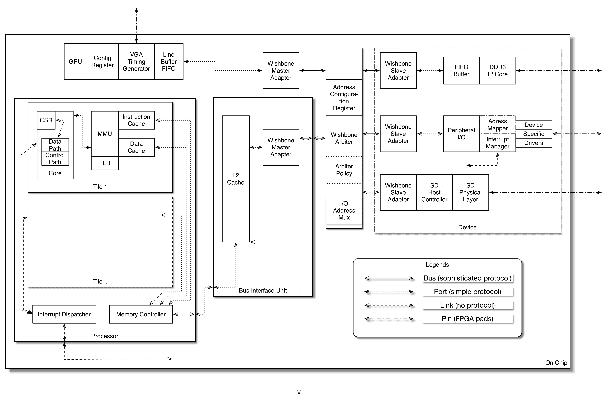

__Hook up a SoC as easy as playing LEGO&reg;__
* * * *

The purpose of this project is to produce a *generic* and *open source* tool to generate a SoC design from a configuration interface.
Various processor cores with different instruction architecutre are available for configuration rather than one which serveral current systems have already achived.

## New Ecosystem

A comprehensive project with four major features:

+ Various processor architecture supported.
+ Seamless switching between several bus specifications.
+ Generic peripheral libraries.
+ Extensive documentation

Conceptual diagram (first stage):
Wishbone is just for demonstration. Other bus protocols should be supported.

## Detailed implementation
### Interface standardization
Four kinds of signal types are defined.
#### Port
Each interface comprises two bundles of data and one address line. For these two bundles, one is for read, and another is for write. Each bundle contains three lines from the master side of view. They are request/valid/data.
#### Bus
Bus Interface Unit(BIU) convert port signal into bus signals.
#### Link
No restrictions.
#### Pin
Three state signals can only be instantiated in these signal bundles. Also, they are the ones coming out of the highest level module.
### Processor
#### Standardized Interface
Single Port connects to the BIU and the internal memory arbiter. Maybe Different Port for instruction and data can be considered.
32-bit external interrupt input connects to internal interrupt manger. If less than 32 input lines, just leave extra wires unconnected.
#### Cores
Port these cores first:

+ LM32: highest priority, compiler support is unified.
+ MIPS32-xum
+ RISCV
+ OpenRISC: mor1kx or or1200
+ Yeji Core

Later, some synthesizable cores available at OpenCores can be added to the library. Only need to add BIU to adapt them to this project:

+ OpenSPARC (already with wishbone BIU)
+ ARM (armv2)
+ AVR (8-bit)
+ x86 (we'll see)
+ m68k

+ Eventually MIPS32 M4K

### Bus
Wishbone first.
AHB/AXI
Avalon

Note that Wishbone to AHB/AXI Avalon bridge available at OpenCores.

### Peripheral
SRAM
DDR3
SPI Flash
UART 16550
SD
Ethernet

## OS
RTEMS (No MMU?)
lcore (MMU)

## Compilers
If GCC, then GCC.
Else, custom LLVM backend.
Perhaps only Yeji Core need a LLVM backend.

## GUI
Later on, hook up with intuitive GUI.

* * * *

## Appendix: Survey on Current Available Approaches
### High-level Hardware Description Language (HL-HDL)
`HL-HDL` is a term coined by me. But there is a trend of this, like a transition from assembly to high-level programming language.
#### Bluespec
Pretty mature ecosystem. Though Bluespec needs license. There is a open source implementation of BSV. Search for Bluespec toy compiler.
#### Chisel
Known.
#### MyHDL
A synthesizable subset can be used to generate Verilog/VHDL.
#### Cx
Not mature.
#### Orangepath H2
Seemed to be excellent, but no usable distribution currently.
### Open Source SoC
#### GRLIB IP library including LEON4
Configurable SPARC V8 processor. A plethora of peripherals as well as boards are supported. Design were written in VHDL with heavy use of directives, which makes it difficult for reuse. Dual license applied.
#### FuseSoC
Succeeding project of ORPSoC. It adopted configuration file to generate RTL code for SoC. Python scripts are used to complete the automation process.
Lacking of documents hinders the community to contribute to the project or utilize it.
#### FHDL / Migen
Written in Python, with a HL-HDL callded FHDL.
### Commercial Product for SoC Generation
#### SOPC Builder
Widely acknowledge feature of Altera. NIOS II processor.
#### LatticeMico System
LM32 with various Wishbone devices
#### XPS and Vivado
Xilinx MicroBlaze
#### System Designer
Bundled with Synplify Pro?
