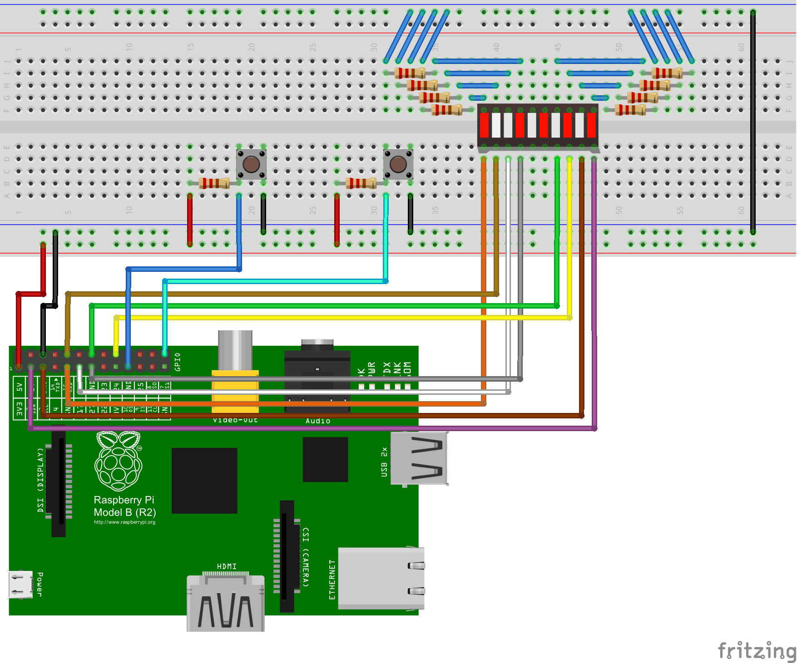
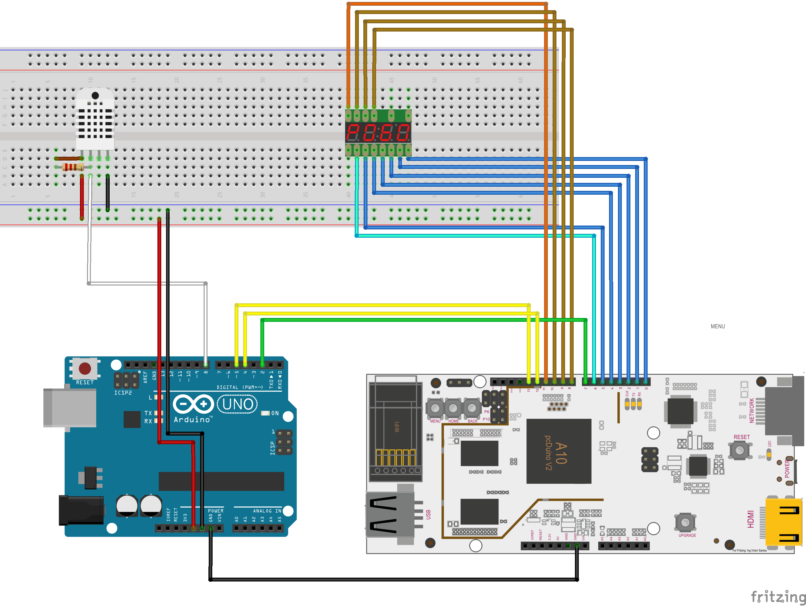

<a name="elev"></a>

<script>
$(document).ready(function(){
 $("#lab7-src2").parent().next().slideUp();
 $("#lab7-src").parent().next().slideUp();
 $("#lab6-src").parent().next().slideUp();

  $("#lab7-src2").click(function(){
    $("#lab7-src2").parent().next().slideToggle();
  });

  $("#lab7-src").click(function(){
    $("#lab7-src").parent().next().slideToggle();
  });

  $("#lab6-src").click(function(){
    $("#lab6-src").parent().next().slideToggle();
  });
});</script>

## 电梯间

<br/><br/><br/><br/><br/>

<ul>
  <li><a href="#lab6">lab6</a></li>
  <li><a href="#lab7">lab7</a></li>
  <li><a href="#lab8">lab8</a></li>
</ul>

<a name="lab6"></a><br/><br/><br/><br/><br/><br/>

---

## lab6

<a href="#elev">回电梯间</a>

有现成的工具可利用

```
git clone git://git.drogon.net/wiringPi
```

编译安装

根据接口定义接线

`pi@rpb ~/wiringPi $ gpio readall`

```
 +-----+-----+---------+------+---+-Model B2-+---+------+---------+-----+-----+
 | BCM | wPi |   Name  | Mode | V | Physical | V | Mode | Name    | wPi | BCM |
 +-----+-----+---------+------+---+----++----+---+------+---------+-----+-----+
 |     |     |    3.3v |      |   |  1 || 2  |   |      | 5v      |     |     |
 |   2 |   8 |   SDA.1 |   IN | 1 |  3 || 4  |   |      | 5V      |     |     |
 |   3 |   9 |   SCL.1 |   IN | 1 |  5 || 6  |   |      | 0v      |     |     |
 |   4 |   7 | GPIO. 7 |   IN | 1 |  7 || 8  | 1 | ALT0 | TxD     | 15  | 14  |
 |     |     |      0v |      |   |  9 || 10 | 1 | ALT0 | RxD     | 16  | 15  |
 |  17 |   0 | GPIO. 0 |   IN | 0 | 11 || 12 | 0 | IN   | GPIO. 1 | 1   | 18  |
 |  27 |   2 | GPIO. 2 |   IN | 0 | 13 || 14 |   |      | 0v      |     |     |
 |  22 |   3 | GPIO. 3 |   IN | 0 | 15 || 16 | 0 | IN   | GPIO. 4 | 4   | 23  |
 |     |     |    3.3v |      |   | 17 || 18 | 0 | IN   | GPIO. 5 | 5   | 24  |
 |  10 |  12 |    MOSI |   IN | 0 | 19 || 20 |   |      | 0v      |     |     |
 |   9 |  13 |    MISO |   IN | 0 | 21 || 22 | 0 | IN   | GPIO. 6 | 6   | 25  |
 |  11 |  14 |    SCLK |   IN | 0 | 23 || 24 | 1 | IN   | CE0     | 10  | 8   |
 |     |     |      0v |      |   | 25 || 26 | 1 | IN   | CE1     | 11  | 7   |
 +-----+-----+---------+------+---+----++----+---+------+---------+-----+-----+
 |  28 |  17 | GPIO.17 |   IN | 0 | 51 || 52 | 0 | IN   | GPIO.18 | 18  | 29  |
 |  30 |  19 | GPIO.19 |   IN | 0 | 53 || 54 | 0 | IN   | GPIO.20 | 20  | 31  |
 +-----+-----+---------+------+---+----++----+---+------+---------+-----+-----+
 | BCM | wPi |   Name  | Mode | V | Physical | V | Mode | Name    | wPi | BCM |
 +-----+-----+---------+------+---+-Model B2-+---+------+---------+-----+-----+
```

按钮接上拉电阻，所有灯串上限流电阻。



搞定之后写相应驱动外设的代码

<i id="lab6-src">显示/隐藏</i>

```cpp
#include <iostream>
#include <wiringPi.h>
int main (void)
{
  wiringPiSetup () ;
    pinMode (0, OUTPUT) ;
    pinMode (1, OUTPUT) ;
    pinMode (2, OUTPUT) ;
    pinMode (3, OUTPUT) ;
    pinMode (4, OUTPUT) ;
    pinMode (5, OUTPUT) ;
    pinMode (6, OUTPUT) ;
    pinMode (7, OUTPUT) ;

    pinMode (11, INPUT);
    pinMode (12, INPUT);

    int go = 0;
    int i = 0;
    int count = 0;
    int value[8] = {0,0,0,0,0,0,0,0};

  for (;;)
    {
        if (0 == go && digitalRead(11) == 0) {
            while( !digitalRead(11) == 1 );
            go = 1;
        }
        if (1 == go && digitalRead(12) == 0) { // pushed
            while( !digitalRead(12) == 1); // released
            go = 0;
        }
        if (go == 1) {
            if (count ++ == 500000) {
                count = 0;

                digitalWrite (i % 8, value[i%8]++ % 2);
                                i++;
               std::cout<< '\r' << i <<' ' << std::flush;
                if (i==16) i = 0;
            }
        }
    }
  return 0 ;
}
```

编译时带参数`-lwiringPi`

运行效果

<embed src="http://player.youku.com/player.php/sid/XMTI1NTEyOTQ5Ng==/v.swf" allowFullScreen="true" quality="high" width="480" height="400" align="middle" allowScriptAccess="always" type="application/x-shockwave-flash"></embed>

<a name="lab7"></a><br/><br/><br/><br/><br/><br/>

---

## lab7

<a href="#elev">回电梯间</a>

随便找一个代码源

```bash
git clone https://github.com/????/ucos-ii-for-pcDuino
```

先编译 arduino 动态连接库得到 libarduino.so
之后运行链接 arduino 库的程序时候得先，`pwd`的位置得找准。

```bash
export LD_LIBRARY_PATH=`pwd`/arduino:$LD_LIBRARY_PATH
```

`config.mk` 添加一点内容，这样就支持了`c++`代码的编译

```make
$(BUILDDIR)/%.o : %.cpp
	@$(CXX) $(CFLAGS) $(INCS) -c -o   $@ $^
	@echo "  [CXX] $@"
```

`config.mk`中`LDFLAG`加上`-lstdc++`解决防止链接时候找不到库而不爆炸的事情不发生。

`app`文件夹中`c`文件后缀改成`cpp`

`make`一下。解决一些编译错误，比如`void*`改成`OS_STK*`。还有些`unused variable warning`，最好别折腾了，删掉了就段错误，十分神奇。

这些代码真是丑到喷鼻血

最后调一下`ucos`文件夹下`ucos_cfg.h`里的一个设置。这样的话调用`OS..Dly`的时候单位就是毫秒了。

```cpp
#define OS_TICKS_PER_SEC       1000
```

这个时候数码管开心地跑起来了，显示出奇怪的图形。折腾了半天找到了原因是一些端口即使设置了`pinMode`也不听话。

不听话就来硬的咯。找到`sys`下的类文件。

```
/sys/devices/virtual/misc/gpio/mode/
/sys/devices/virtual/misc/gpio/pin/
```

每次设置完`pinMode`再来一次强制模式转变，这样所有的端口都乖乖听话，显示就正常了。

```cpp
    system("echo 1 > /sys/devices/virtual/misc/gpio/mode/gpio3");
    system("echo 1 > /sys/devices/virtual/misc/gpio/mode/gpio6");
    system("echo 1 > /sys/devices/virtual/misc/gpio/mode/gpio9");
```

接下去就是整传感器驱动，单总线的时序就是用来给工程师们添堵的，不带时钟线但是数据对时序十分敏感，而且还是微秒级的精度。

先在 Arduino 上整了一个能正常用的驱动，然后把代码放到 pcDuino 上跑，实在不敢确定几微妙的延时函数在 Linux 这样的操作系统下能够正确跑下来。事实也是如此，不过失败的还有一个可能原因是 GPIO 口没有控制好。

实在没辙，只好自定义的了个 Arduino 与 pcDuino 间的通讯方式。读取传感器由“协处理器”完成。然后板间通讯有一条线送时钟，两条线送数据。Arduino 开机先读一次数据，然后等待时钟线拉高，每次拉高传送两个八比特数据。这样的话温度和湿度作为两个八比特的整数传到接收方的板子里。传完两个数后，再读取一次传感器数据。接收方大概每两秒发起数据接收请求，发送方有足够的时间重新读取传感器数据。

#### Arduino 程序

<i id="lab7-src">显示/隐藏</i>

```cpp
#ifndef DHT_H
#define DHT_H
#if ARDUINO >= 100
#include "Arduino.h"
#else
#include "WProgram.h"
#endif

/* DHT library
MIT license
written by Adafruit Industries
*/

// how many timing transitions we need to keep track of. 2 * number bits + extra
#define MAXTIMINGS 85

#define DHT11 11
#define DHT22 22
#define DHT21 21
#define AM2301 21

class DHT {
  private:
    uint8_t data[6];
    uint8_t _pin, _type, _count;
    unsigned long _lastreadtime;
    boolean firstreading;

  public:
    DHT(uint8_t pin, uint8_t type, uint8_t count = 6);
    void begin(void);
    float readTemperature(bool S = false);
    float convertCtoF(float);
    float convertFtoC(float);
    float computeHeatIndex(float tempFahrenheit, float percentHumidity);
    float readHumidity(void);
    boolean read(void);

};
#endif

DHT::DHT(uint8_t pin, uint8_t type, uint8_t count) {
  _pin = pin;
  _type = type;
  _count = count;
  firstreading = true;
}

void DHT::begin(void) {
  // set up the pins!
  pinMode(_pin, INPUT);
  digitalWrite(_pin, HIGH);
  _lastreadtime = 0;
}

//boolean S == Scale.  True == Farenheit; False == Celcius
float DHT::readTemperature(bool S) {
  float f;

  if (read()) {
    switch (_type) {
      case DHT11:
        f = data[2];
        if (S)
          f = convertCtoF(f);

        return f;
      case DHT22:
      case DHT21:
        f = data[2] & 0x7F;
        f *= 256;
        f += data[3];
        f /= 10;
        if (data[2] & 0x80)
          f *= -1;
        if (S)
          f = convertCtoF(f);

        return f;
    }
  }
  return NAN;
}

float DHT::convertCtoF(float c) {
  return c * 9 / 5 + 32;
}

float DHT::convertFtoC(float f) {
  return (f - 32) * 5 / 9;
}

float DHT::readHumidity(void) {
  float f;
  if (read()) {
    switch (_type) {
      case DHT11:
        f = data[0];
        return f;
      case DHT22:
      case DHT21:
        f = data[0];
        f *= 256;
        f += data[1];
        f /= 10;
        return f;
    }
  }
  return NAN;
}

float DHT::computeHeatIndex(float tempFahrenheit, float percentHumidity) {
  // Adapted from equation at: https://github.com/adafruit/DHT-sensor-library/issues/9 and
  // Wikipedia: http://en.wikipedia.org/wiki/Heat_index
  return -42.379 +
         2.04901523 * tempFahrenheit +
         10.14333127 * percentHumidity +
         -0.22475541 * tempFahrenheit * percentHumidity +
         -0.00683783 * pow(tempFahrenheit, 2) +
         -0.05481717 * pow(percentHumidity, 2) +
         0.00122874 * pow(tempFahrenheit, 2) * percentHumidity +
         0.00085282 * tempFahrenheit * pow(percentHumidity, 2) +
         -0.00000199 * pow(tempFahrenheit, 2) * pow(percentHumidity, 2);
}


boolean DHT::read(void) {
  uint8_t laststate = HIGH;
  uint8_t counter = 0;
  uint8_t j = 0, i;
  //  unsigned long currenttime;

  //  // Check if sensor was read less than two seconds ago and return early
  //  // to use last reading.
  //  currenttime = millis();
  //  if (currenttime < _lastreadtime) {
  //    // ie there was a rollover
  //    _lastreadtime = 0;
  //  }
  //  if (!firstreading && ((currenttime - _lastreadtime) < 2000)) {
  //    return true; // return last correct measurement
  //    //delay(2000 - (currenttime - _lastreadtime));
  //  }
  //  firstreading = false;
  //  /*
  //    Serial.print("Currtime: "); Serial.print(currenttime);
  //    Serial.print(" Lasttime: "); Serial.print(_lastreadtime);
  //  */
  //  _lastreadtime = millis();

  data[0] = data[1] = data[2] = data[3] = data[4] = 0;

  // pull the pin high and wait 250 milliseconds
  digitalWrite(_pin, HIGH);
  delay(250);

  // now pull it low for ~20 milliseconds
  pinMode(_pin, OUTPUT);
  digitalWrite(_pin, LOW);
  delay(20);
  noInterrupts();
  digitalWrite(_pin, HIGH);
  delayMicroseconds(40);
  pinMode(_pin, INPUT);

  // read in timings
  for ( i = 0; i < MAXTIMINGS; i++) {
    counter = 0;
    while (digitalRead(_pin) == laststate) {
      counter++;
      delayMicroseconds(1);
      if (counter == 255) {
        break;
      }
    }
    laststate = digitalRead(_pin);

    if (counter == 255) break;

    // ignore first 3 transitions
    if ((i >= 4) && (i % 2 == 0)) {
      // shove each bit into the storage bytes
      data[j / 8] <<= 1;
      if (counter > _count)
        data[j / 8] |= 1;
      j++;
    }

  }

  interrupts();

  // check we read 40 bits and that the checksum matches
  if ((j >= 40) &&
      (data[4] == ((data[0] + data[1] + data[2] + data[3]) & 0xFF)) ) {
    return true;
  }


  return false;

}


#define DHTPIN 8     // what pin we're connected to

// Uncomment whatever type you're using!
#define DHTTYPE DHT11   // DHT 11
//#define DHTTYPE DHT22   // DHT 22  (AM2302)
//#define DHTTYPE DHT21   // DHT 21 (AM2301)

// Connect pin 1 (on the left) of the sensor to +5V
// NOTE: If using a board with 3.3V logic like an Arduino Due connect pin 1
// to 3.3V instead of 5V!
// Connect pin 2 of the sensor to whatever your DHTPIN is
// Connect pin 4 (on the right) of the sensor to GROUND
// Connect a 10K resistor from pin 2 (data) to pin 1 (power) of the sensor

// Initialize DHT sensor for normal 16mhz Arduino
DHT dht(DHTPIN, DHTTYPE, 8);
// NOTE: For working with a faster chip, like an Arduino Due or Teensy, you
// might need to increase the threshold for cycle counts considered a 1 or 0.
// You can do this by passing a 3rd parameter for this threshold.  It's a bit
// of fiddling to find the right value, but in general the faster the CPU the
// higher the value.  The default for a 16mhz AVR is a value of 6.  For an
// Arduino Due that runs at 84mhz a value of 30 works.
// Example to initialize DHT sensor for Arduino Due:
//DHT dht(DHTPIN, DHTTYPE, 30);


const int ack_pin = 2;
const int dat1_pin = 4;
const int dat2_pin = 5;
const int led_pin = 13;

int bitp = 0;
int temp = 99;
int humid = 99;

void setup() {
  Serial.begin(9600);
  dht.begin();
  temp = dht.readTemperature();
  humid = dht.readHumidity();
  // put your setup code here, to run once:
  pinMode(ack_pin, INPUT);
  pinMode(dat1_pin, OUTPUT);
  pinMode(dat2_pin, OUTPUT);
  pinMode(led_pin, OUTPUT);
}


void loop() {
  // put your main code here, to run repeatedly:
  if (digitalRead(ack_pin)) {
    digitalWrite(led_pin, HIGH);
    if (bitp < 8) {
      digitalWrite(dat1_pin, (temp >> bitp) & 0b00000001);
      digitalWrite(dat2_pin, (temp >> bitp + 1) & 0b00000001);
      bitp += 2;
    }
    else {
      digitalWrite(dat1_pin, (humid >> bitp - 8) & 0b00000001);
      digitalWrite(dat2_pin, (humid >> bitp - 7) & 0b00000001);
      bitp += 2;
      if (bitp == 16) {
        bitp = 0;
        temp = dht.readTemperature();
        humid = dht.readHumidity();
        Serial.print("Humidity: ");
        Serial.print(humid);
        Serial.print(" %\t");
        Serial.print("Temperature: ");
        Serial.print(temp);
        Serial.print(" *C \n");
      }
    }
    while (digitalRead(ack_pin));
  }
  else {
    digitalWrite(led_pin, LOW);
  }
}
```

#### RTOS 程序

<i id="lab7-src2">显示/隐藏</i>

```cpp
#include <stdio.h>
#include <stdlib.h>
#include "ucos_ii.h"
#include <core.h>
#include <string.h>
#include <iostream>

using namespace std;

int digi   = 8;
int digit2 = 9;
int digit3 = 10;
int digit4 = 11;
int segA = 0;
int segB = 1;
int segC = 2;
int segD = 3;
int segE = 4;
int segF = 5;
int segG = 6;

int ack = 7;
int dat1 = 12;
int dat2 = 13;
#define DHTPIN 7

void hardware_init()
{
  pinMode(segA, OUTPUT);
  pinMode(segB, OUTPUT);
  pinMode(segC, OUTPUT);
  pinMode(segD, OUTPUT);
  pinMode(segE, OUTPUT);
  pinMode(segF, OUTPUT);
  pinMode(segG, OUTPUT);

  pinMode(digi, OUTPUT);
  pinMode(digit2, OUTPUT);
  pinMode(digit3, OUTPUT);
  pinMode(digit4, OUTPUT);


  // hack: fix mode
  system("echo 1 > /sys/devices/virtual/misc/gpio/mode/gpio3");
  system("echo 1 > /sys/devices/virtual/misc/gpio/mode/gpio6");
  system("echo 1 > /sys/devices/virtual/misc/gpio/mode/gpio9");

  pinMode(ack, OUTPUT);
  system("echo 1 > /sys/devices/virtual/misc/gpio/mode/gpio7");
  pinMode(dat1, INPUT);
  pinMode(dat2, INPUT);
  system("echo 0 > /sys/devices/virtual/misc/gpio/mode/gpio12");
  system("echo 0 > /sys/devices/virtual/misc/gpio/mode/gpio13");

}

void lightNumber(int numberToDisplay) {

#define SEGMENT_ON  LOW
#define SEGMENT_OFF HIGH

  switch (numberToDisplay) {

  case 0:
    digitalWrite(segA, SEGMENT_ON);
    digitalWrite(segB, SEGMENT_ON);
    digitalWrite(segC, SEGMENT_ON);
    digitalWrite(segD, SEGMENT_ON);
    digitalWrite(segE, SEGMENT_ON);
    digitalWrite(segF, SEGMENT_ON);
    digitalWrite(segG, SEGMENT_OFF);
    break;

  case 1:
    digitalWrite(segA, SEGMENT_OFF);
    digitalWrite(segB, SEGMENT_ON);
    digitalWrite(segC, SEGMENT_ON);
    digitalWrite(segD, SEGMENT_OFF);
    digitalWrite(segE, SEGMENT_OFF);
    digitalWrite(segF, SEGMENT_OFF);
    digitalWrite(segG, SEGMENT_OFF);
    break;

  case 2:
    digitalWrite(segA, SEGMENT_ON);
    digitalWrite(segB, SEGMENT_ON);
    digitalWrite(segC, SEGMENT_OFF);
    digitalWrite(segD, SEGMENT_ON);
    digitalWrite(segE, SEGMENT_ON);
    digitalWrite(segF, SEGMENT_OFF);
    digitalWrite(segG, SEGMENT_ON);
    break;

  case 3:
    digitalWrite(segA, SEGMENT_ON);
    digitalWrite(segB, SEGMENT_ON);
    digitalWrite(segC, SEGMENT_ON);
    digitalWrite(segD, SEGMENT_ON);
    digitalWrite(segE, SEGMENT_OFF);
    digitalWrite(segF, SEGMENT_OFF);
    digitalWrite(segG, SEGMENT_ON);
    break;

  case 4:
    digitalWrite(segA, SEGMENT_OFF);
    digitalWrite(segB, SEGMENT_ON);
    digitalWrite(segC, SEGMENT_ON);
    digitalWrite(segD, SEGMENT_OFF);
    digitalWrite(segE, SEGMENT_OFF);
    digitalWrite(segF, SEGMENT_ON);
    digitalWrite(segG, SEGMENT_ON);
    break;

  case 5:
    digitalWrite(segA, SEGMENT_ON);
    digitalWrite(segB, SEGMENT_OFF);
    digitalWrite(segC, SEGMENT_ON);
    digitalWrite(segD, SEGMENT_ON);
    digitalWrite(segE, SEGMENT_OFF);
    digitalWrite(segF, SEGMENT_ON);
    digitalWrite(segG, SEGMENT_ON);
    break;

  case 6:
    digitalWrite(segA, SEGMENT_ON);
    digitalWrite(segB, SEGMENT_OFF);
    digitalWrite(segC, SEGMENT_ON);
    digitalWrite(segD, SEGMENT_ON);
    digitalWrite(segE, SEGMENT_ON);
    digitalWrite(segF, SEGMENT_ON);
    digitalWrite(segG, SEGMENT_ON);
    break;

  case 7:
    digitalWrite(segA, SEGMENT_ON);
    digitalWrite(segB, SEGMENT_ON);
    digitalWrite(segC, SEGMENT_ON);
    digitalWrite(segD, SEGMENT_OFF);
    digitalWrite(segE, SEGMENT_OFF);
    digitalWrite(segF, SEGMENT_OFF);
    digitalWrite(segG, SEGMENT_OFF);
    break;

  case 8:
    digitalWrite(segA, SEGMENT_ON);
    digitalWrite(segB, SEGMENT_ON);
    digitalWrite(segC, SEGMENT_ON);
    digitalWrite(segD, SEGMENT_ON);
    digitalWrite(segE, SEGMENT_ON);
    digitalWrite(segF, SEGMENT_ON);
    digitalWrite(segG, SEGMENT_ON);
    break;

  case 9:
    digitalWrite(segA, SEGMENT_ON);
    digitalWrite(segB, SEGMENT_ON);
    digitalWrite(segC, SEGMENT_ON);
    digitalWrite(segD, SEGMENT_ON);
    digitalWrite(segE, SEGMENT_OFF);
    digitalWrite(segF, SEGMENT_ON);
    digitalWrite(segG, SEGMENT_ON);
    break;

  case 10:
    digitalWrite(segA, SEGMENT_OFF);
    digitalWrite(segB, SEGMENT_OFF);
    digitalWrite(segC, SEGMENT_OFF);
    digitalWrite(segD, SEGMENT_OFF);
    digitalWrite(segE, SEGMENT_OFF);
    digitalWrite(segF, SEGMENT_OFF);
    digitalWrite(segG, SEGMENT_OFF);
    break;
  }
}

void displayNumber(int toDisplay, int offwhich) {
#define DISPLAY_BRIGHTNESS  5000

#define DIGIT_ON  HIGH
#define DIGIT_OFF  LOW


  int off1, off2, off3, off4;
  if (offwhich) {
    off1 = off2 = 1;
    off3 = off4 = 0;
  } else {
    off1 = off2 = 0;
    off3 = off4 = 1;
  }

  for (int digit = 4 ; digit > 0 ; digit--) {

    //Turn on a digit for a short amount of time
    switch (digit) {
    case 1:
      digitalWrite(digi, DIGIT_ON & off1);
      break;
    case 2:
      digitalWrite(digit2, DIGIT_ON & off2);
      break;
    case 3:
      digitalWrite(digit3, DIGIT_ON & off3);
      break;
    case 4:
      digitalWrite(digit4, DIGIT_ON & off4);
      break;
    }

    //Turn on the right segments for this digit
    lightNumber(toDisplay % 10);
    toDisplay /= 10;

    //delayMicroseconds(DISPLAY_BRIGHTNESS);
    OSTimeDly(5);
    //Display digit for fraction of a second (1us to 5000us, 500 is pretty good)

    //Turn off all segments
    lightNumber(10);

    //Turn off all digits
    digitalWrite(digi, DIGIT_OFF);
    digitalWrite(digit2, DIGIT_OFF);
    digitalWrite(digit3, DIGIT_OFF);
    digitalWrite(digit4, DIGIT_OFF);
  }

  //  while ( (millis() - beginTime) < 10) ;
  //Wait for 20ms to pass before we paint the display again
}


/* DHT library
   MIT license
   written by Adafruit Industries
*/

// how many timing transitions we need to keep track of. 2 * number bits + extra
#define MAXTIMINGS 85

#define DH1 11
#define DHT22 22
#define DHT21 21
#define AM2301 21

class DHT {
private:
  uint8_t data[6];
  uint8_t _pin, _type, _count;
  unsigned long _lastreadtime;
  boolean firstreading;

public:
  DHT(uint8_t pin, uint8_t type, uint8_t count=6);
  void begin(void);
  float readTemperature(bool S=false);
  float convertCtoF(float);
  float convertFtoC(float);
  float computeHeatIndex(float tempFahrenheit, float percentHumidity);
  float readHumidity(void);
  boolean read(void);

};

DHT::DHT(uint8_t pin, uint8_t type, uint8_t count) {
  _pin = pin;
  _type = type;
  _count = count;
  firstreading = true;
}

void DHT::begin(void) {
  // set up the pins!
  pinMode(_pin, INPUT);
  digitalWrite(_pin, HIGH);
}
float DHT::readTemperature(bool S) {
  float f;

  if (read()) {
    switch (_type) {
    case DH1:
      f = data[2];
      if(S)
      	f = convertCtoF(f);

      return f;
    case DHT22:
    case DHT21:
      f = data[2] & 0x7F;
      f *= 256;
      f += data[3];
      f /= 10;
      if (data[2] & 0x80)
	f *= -1;
      if(S)
	f = convertCtoF(f);

      return f;
    }
  }
  return NAN;
}

float DHT::convertCtoF(float c) {
  return c * 9 / 5 + 32;
}

float DHT::convertFtoC(float f) {
  return (f - 32) * 5 / 9;
}

float DHT::readHumidity(void) {
  float f;
  if (read()) {
    switch (_type) {
    case DH1:
      f = data[0];
      return f;
    case DHT22:
    case DHT21:
      f = data[0];
      f *= 256;
      f += data[1];
      f /= 10;
      return f;
    }
  }
  return NAN;
}

boolean DHT::read(void) {
  uint8_t laststate = HIGH;
  uint8_t counter = 0;
  uint8_t j = 0, i;

  data[0] = data[1] = data[2] = data[3] = data[4] = 0;

  // pull the pin high and wait 250 milliseconds
  digitalWrite(_pin, HIGH);
  // 1
  OSTimeDly(250);
  /*
    __________          ______
    |________|
    200ms     20ms    40us
    1

  */
  // now pull it low for ~20 milliseconds
  // 2
  pinMode(_pin, OUTPUT);
  system("echo 1 > /sys/devices/virtual/misc/gpio/mode/gpio7");
  digitalWrite(_pin, LOW);
  OSTimeDly(20);
  digitalWrite(_pin, HIGH);
  // 3
  delayMicroseconds(40);
  pinMode(_pin, INPUT);
  system("echo 0 > /sys/devices/virtual/misc/gpio/mode/gpio7");

  // read in timings
  for ( i=0; i< MAXTIMINGS; i++) {
    counter = 0;
    while (digitalRead(_pin) == laststate) {
      counter++;
      delayMicroseconds(1);
      if (counter == 255) {
        break;
      }
    }
    laststate = digitalRead(_pin);

    if (counter == 255)
      {
        cout << "bao zha. j: " << (int) j << " pin: " << (int) _pin  << " state: " << (int) digitalRead(_pin) << endl;
        break;
      }

    // ignore first 3 transitions
    if ((i >= 4) && (i%2 == 0)) {
      // shove each bit into the storage bytes
      data[j/8] <<= 1;
      if (counter > _count)
        data[j/8] |= 1;
      j++;
      cout << "inc: j" << endl;
    }

  }

  cout << (int)j << endl;
  // check we read 40 bits and that the checksum matches
  if ((j >= 40) &&
      (data[4] == ((data[0] + data[1] + data[2] + data[3]) & 0xFF)) ) {
    return true;
  }


  return true;

}


#define DHTTYPE DH1   // DHT 11

DHT dht(DHTPIN, DHTTYPE, 50);

float h, t, f;
int temp;
int humid;
int bitp = 0;
int delay_time = 10;
void T1( void *p_arg )
{

  char* sTaskName = (char*)p_arg;
  static int flag1 = 1;
#if OS_CRITICAL_METHOD == 3
  OS_CPU_SR     cpu_sr = 0;
#endif
  int _temp = 0;
  int _humid = 0;
  while(1)
    {
      OS_ENTER_CRITICAL();

      if(!strcmp(sTaskName,"Task 1"))
	{
	  //h = dht.readHumidity();
	  //t = dht.readTemperature();
	  while (1) {
	    digitalWrite(ack, 1);
	    OSTimeDly(1);
	    if (bitp < 8) {
	      _temp += (digitalRead(dat1) + (digitalRead(dat2) << 1)) << bitp;
	      //cout << (int) (digitalRead(dat1)) + 10 * (digitalRead(dat2)) << endl;
	    }
	    else {
	      _humid += (digitalRead(dat1) + (digitalRead(dat2) << 1)) << (bitp - 8);

	    }
	    bitp += 2;
	    digitalWrite(ack, 0);
	    if (bitp == 16) {
	      temp = _temp;
	      humid = _humid;
	      bitp = 0, _temp = 0, _humid = 0;
	      printf("humid: %d\n", humid);
	      printf("temp : %d\n", temp);
	      break;
	    }
	  }
	}
      OS_EXIT_CRITICAL();

      /* Delay so other tasks may execute. */
      OSTimeDly(2000);
    }/* while */

}

void T2( void *p_arg )
{

  char* sTaskName = (char*)p_arg;
  static int flag1 = 1;
#if OS_CRITICAL_METHOD == 3
  OS_CPU_SR     cpu_sr = 0;
#endif

  while(1)
    {
      if(!strcmp(sTaskName,"Task 2"))
	{
          if (millis() / 1000 % 2) {
            displayNumber(temp, 0);
          }
          else {
	    displayNumber(humid * 100, 1);
          }
	}
    }/* while */

}

int main (void)
{
  /* pthreads allocates its own memory for task stacks. This UCOS linux port needs a minimum stack size
     in order to pass the function information within the port. */
  hardware_init();
  INT8U Stk1[ OSMinStkSize() ];
  INT8U Stk2[ OSMinStkSize() ];
  INT8U Stk3[ OSMinStkSize() ];
  //	INT8U Stk4[ OSMinStkSize() ];
  //	INT8U Stk5[ OSMinStkSize() ];

  char sTask1[] = "Task 1";
  char sTask2[] = "Task 2";
  //	char sTask3[] = "Task 3";
  //	char sTask4[] = "Task 4";
  //	char sTask5[] = "Task 5";

  OSInit();

  OSTaskCreate( T1, sTask1, (OS_STK*)Stk1, 4 );
  OSTaskCreate( T2, sTask2, (OS_STK*)Stk2, 5 );
  //	OSTaskCreate( T3, sTask3, (OS_STK*)Stk3, 6 );
  //	OSTaskCreate( T4, sTask4, (OS_STK*)Stk4, 7 );
  //	OSTaskCreate( T5, sTask5, (OS_STK*)Stk5, 8 );

  OSStart();

  return 0;
}

```

接线



炫光


运行效果

<embed src="http://player.youku.com/player.php/sid/XMTI1NTEyOTAzNg==/v.swf" allowFullScreen="true" quality="high" width="480" height="400" align="middle" allowScriptAccess="always" type="application/x-shockwave-flash"></embed>

<a name="lab8"></a><br/><br/><br/><br/><br/><br/>

---

## lab8

<a href="#elev">回电梯间</a>

<a href="https://github.com/everskar2013/Zynq_GO">源码以及文档(Github)</a>

运行效果

<embed src="http://player.youku.com/player.php/sid/XOTU1NjA2OTk2/v.swf" allowFullScreen="true" quality="high" width="480" height="400" align="middle" allowScriptAccess="always" type="application/x-shockwave-flash"></embed>
